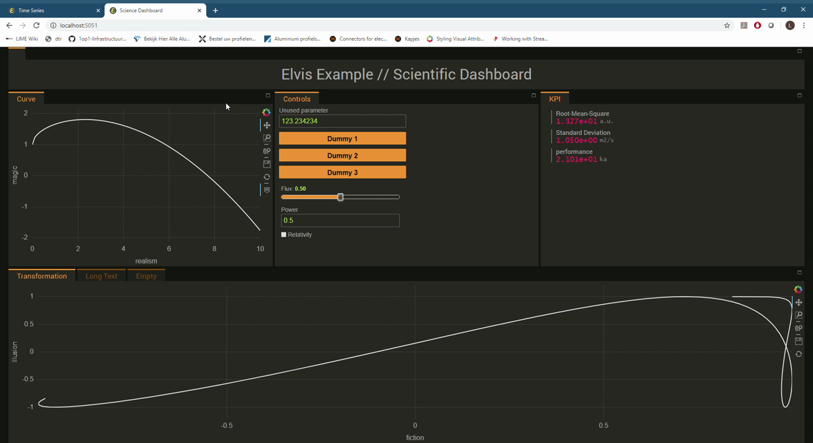

# Elvis

* Combining holoviz panel with the golden-panel layout.
* Author: Leon van Kouwen, lvankouwen@gmail.com
* Last updated: 28-5-2020
* Version 0.1.0

## About elvis

Elvis is primarily intended to enable using all the features of [panel](https://panel.holoviz.org/)
in combination with the [golden-layout](http://golden-layout.com/), in a way that
it can be setup entirely from simple python commands. This enables a nice looking and flexible dashboard
being setup very quickly, while having all the options of python at ones disposal. 

In addition, this package is a collection of somewhat arbitrary
additions to panel. Current functionality includes
* Golden layout combined with panel from pure python
* Altered styling of golden-layout (dark and light theme)
* A KPI widget matching the theme.
* Re-styling of bokeh graphs.
* A-synchronous live calculation and live plotting.

The .js code for golden-layout is included in this package such that the packge
can be used offline as well and to avoid problems when the online golden-layout resources
move or are no longer available. This means that the golden-layout code does not automatically follow
updates of golden-layout. 

NOTE: this package under development and experimental. Some of the solutions
are probably not very scalable/maintainable. In particular the a-synchronous 
live calculation and live plotting isn't what
it could be. I appreciate suggestions, advice, contributions... :).

Feel free to use this for any purpose, within the limits of the licenses of panel and golden-layout.
If you make improvements or additions I kindly ask you to share them. This can be done by adding
them to this repository, or other channels like a blog. Feel free to contact me.

Some documentation is generated using pdoc3 and can be found in 'docs'.

### Impression

## How do I get set up?

### Installation
From the directory in which the package folder is located use the following command to install:

    pip install elvis

It is now possible to remove the elvis folder. To install in developers mode (changes to local
elvis files are active) use:

    pip install -e elvis

At present it is required do use a developers install of panel. Follow the instructions
[here](https://panel.holoviz.org/developer_guide/index.html) and checkout in the branch
static_serve. Use the panel_dev conda environment. Note that this is only required temporarily,
as serving static assets will be included in the standard panel distribution at some point.

* panel 0.10.0a2.post9+g643033f dev_0

It is possible as a work-around to test this package without the developers install. Create a main.py (or move one of the examples) in the root
folder of the repository. Replace the default way of serving from the code

    gpanel.serve()

With
    
    gpanel.servable()

Now from the command line one directory level higher run:

    panel serve elvis
    
In this case it is not needed to pip install elvis.

### Examples
To get started with some examples look at the examples folder.
- live_time_series shows the asynchronous live plotting functionality in the light theme
- science-dashboard shows the dark theme and some standard panel/param functionality.

### Resources

This package is just a very thin layer around the holoviz framework and the golden layout GUI package. 
* [Holoviz](https://holoviz.org/)
* [Holoviz panel](https://panel.holoviz.org/)
* [Holoviz param](https://awesome-panel.org/)
* [Holoviz holoviews](https://holoviews.org/)
* [Golden-layout](https://golden-layout.com/)

A good comparison with other frameworks can be found [here](https://panel.holoviz.org/Comparisons.html).

As a plotting backend I prefer Bokeh, and it is currently the only one that is themed. 
* [Bokeh](https://bokeh.org/)

For demonstrations and more additions to panel, visit
* [Awesome panel](https://awesome-panel.org/)

For bugs and problems with the code in this package, please raise a github issue. For more general questions, the
[holoviz discourse](https://discourse.holoviz.org/) can be used. 

### Future work

#### ToDo
* Fix reset button for streaming plots (resetting a holoviews plot)
* Redesign the streaming module
* Add docstrings
* The css is a mess; needs to be cleaned up
* Prevent overlapping hover pop-ups in Bokeh plots

#### Nice-to-haves
* Remove the 5px left-margin when generating widgets with param.
* A widget that shows stdout
* A global message widget
* Reset the server from a button in the browser
